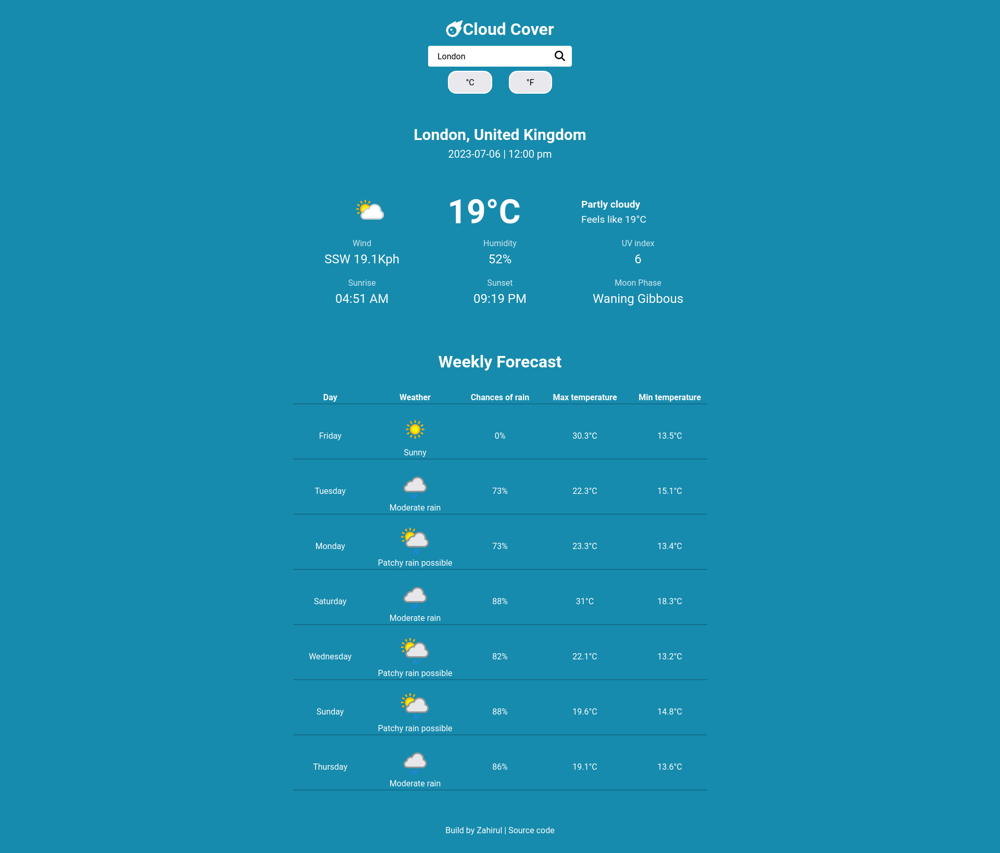

# Weather App

## Table of contents

- [General info](#general-info)
- [Screenshot](#screenshot)
- [Links](#links)
- [Setup](#setup)
- [Technologies](#technologies)
- [Author](#author)

## General info

This is a weather app where can can search for a location.Current weather,
weather condition and next 7 days weather forecast will be shown for that location.

## Screenshot

## Links

- Source Code: [Source Code](https://github.com/ZTanvir/weather-app)
- Live Site URL: [live Site](https://ztanvir.github.io/weather-app/)

## Setup

- Clone the github repo.
- Open the index.html any of your favorite browser.

## Technologies

Project is created with:

- Html5
- Css3
- Javascript
- Font awesome

## Author

- Github - [Zahirul Islam Tanvir](https://github.com/ZTanvir)
